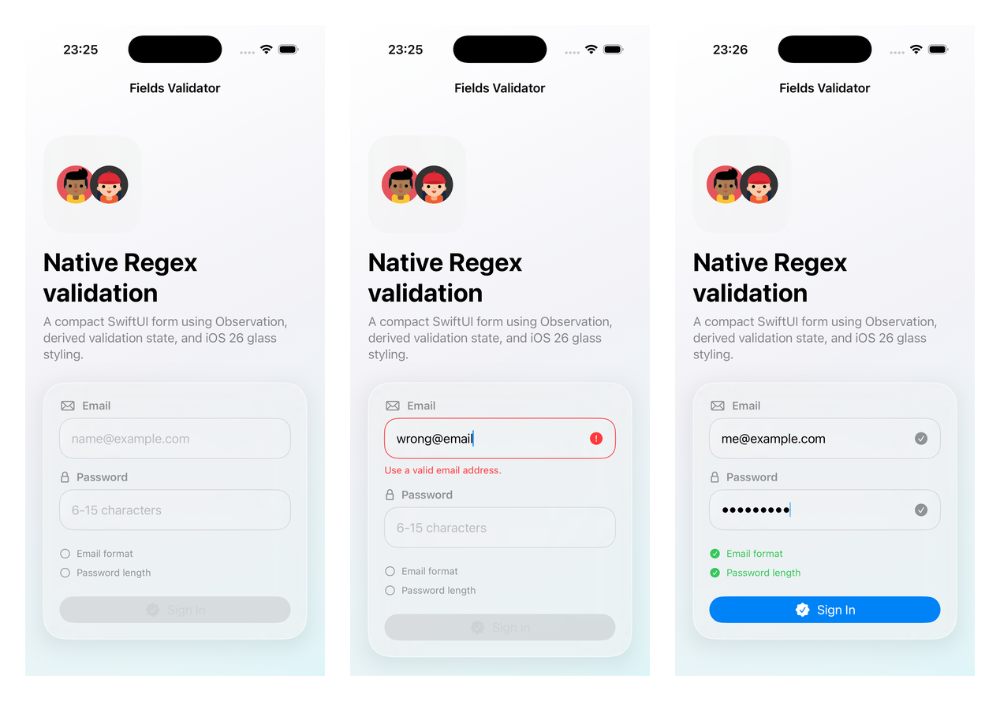

# Fields Validator

A small SwiftUI portfolio project that demonstrates reactive form validation with modern Swift and iOS APIs. The app validates email and password fields with native Swift Regex literals, derives UI state from an `@Observable` form model, and uses iOS 26 Liquid Glass styling for the form surface and primary action.

# Built With

- iOS 26+
- Swift 6
- [SwiftUI](https://developer.apple.com/xcode/swiftui/)
- Observation (`@Observable`)
- Native Swift Regex APIs

# Project Structure

- `App` - SwiftUI app entry point.
- `Features/Validator` - form screen, components, state, and Swift Regex validation rules.
- `Modifiers` - shared SwiftUI view modifiers.

# Contributing

Contributions are what make the open source community such a fantastic place to learn, share, inspire, and create. Any contributions you make are greatly appreciated.

- Fork the project
- Create your feature branch `git checkout -b feature/AmazingFeature`
- Commit your changes `git commit -m 'Add some AmazingFeature'`
- Push to the branch `git push origin feature/AmazingFeature`
- Open a pull request

# License

See [LICENSE](LICENSE)

# Contact

Leonardo Bilia - [@leonardobilia](https://twitter.com/leonardobilia)
